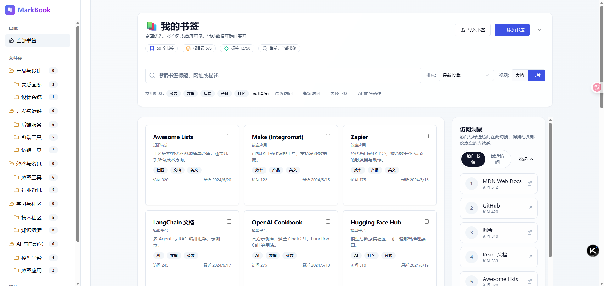
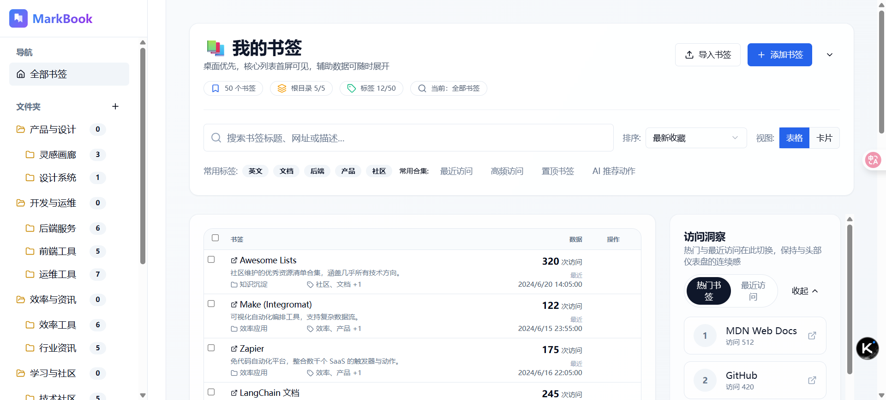
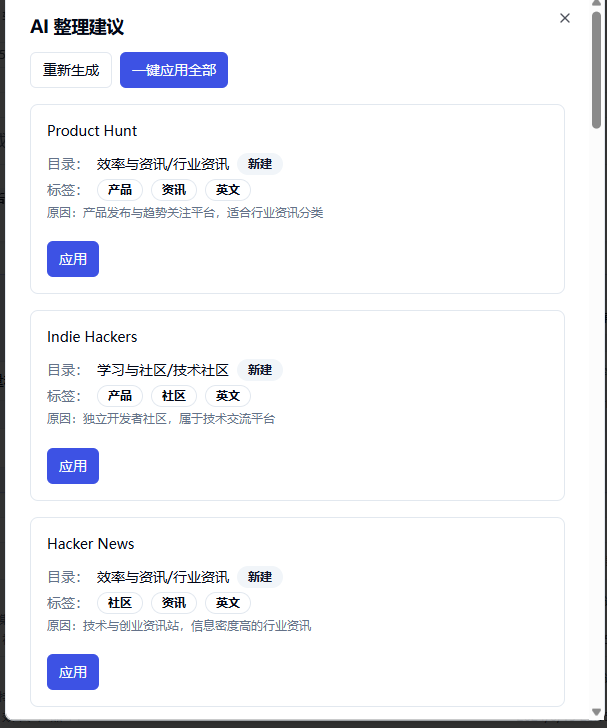
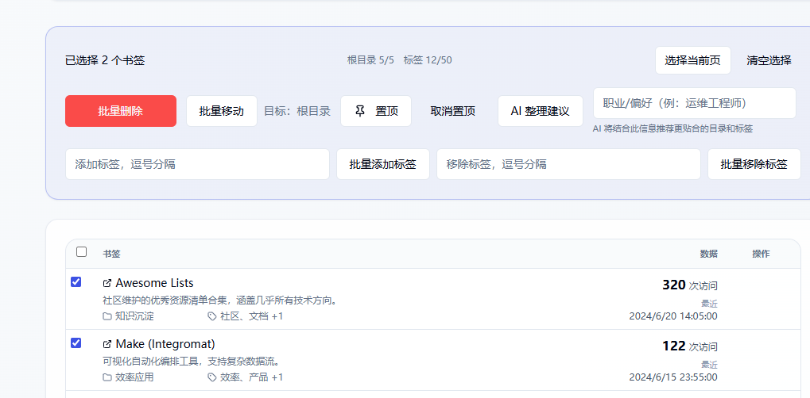
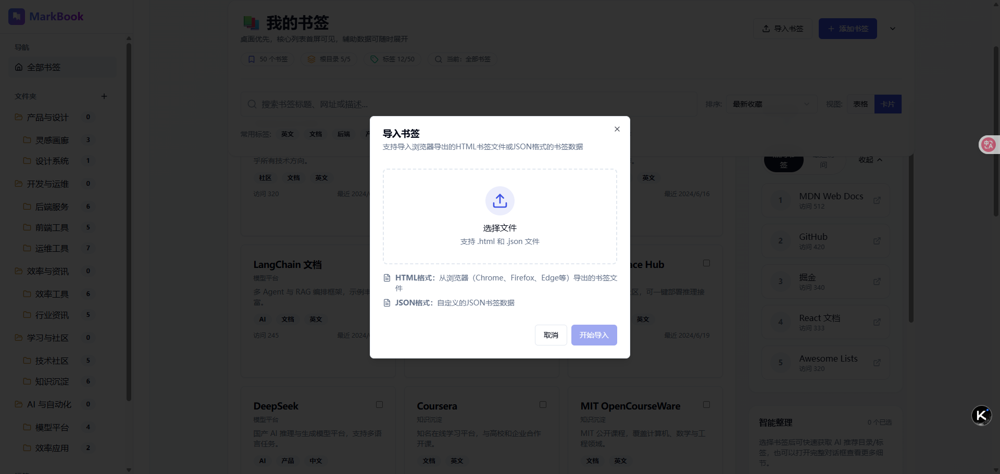

# Bookmark Management System

桌面优先的全栈书签工具，支持固定侧栏、粘性工具栏、访问洞察与 AI 智能整理。内置配额校验（标签 ≤50，根目录 ≤5，二级目录 ≤20），并可一键批量操作。

## 功能亮点
- 书签管理：添加/编辑/删除，批量删除/移动/增删标签，记录 `visitCount` 与 `lastVisitedAt`。
- 筛选与排序：关键词高亮，按收藏时间/访问次数/最近访问排序，常用合集快捷入口（最近访问/高频/置顶/AI）。
- 目录与标签：两级目录限制，标签上限 50，AI 与手动操作共享校验，缺失时可自动新建。
- AI 整理：DeepSeek 提供目录/标签建议，支持职业偏好输入，逐条或一键应用。
- 布局：固定侧栏 + 顶部粘性工具栏 + 右侧粘性洞察/智能整理面板；默认表格视图，可切换卡片。

## 示例界面（在 `docs/image`）

说明：卡片模式下的首屏布局，展示固定侧栏、粘性工具栏与右侧洞察面板。


说明：表格模式列表，强调访问次数、最近访问和批量勾选交互。


说明：AI 建议对话框，可输入职业偏好、查看推荐目录/标签并支持一键应用。


说明：批量工具条，提供删除、移动、增删标签以及置顶等操作反馈。


说明：导入书签流程示例，支持粘贴文件或文本、AI 自动分类。

## 技术栈
- 前端：React 18, TypeScript, Vite, TanStack Router/Query (Suspense), Tailwind + shadcn/ui, MUI Icons
- 后端：Node.js 18, Express, Prisma (SQLite), Zod, dotenv
- AI：DeepSeek Chat Completion，通过 `/api/ai/organize`

## 快速开始
```bash
git clone <repo>
cd bookmark
npm install

# 后端环境变量
cp backend/.env.example backend/.env
# 填写 DEEPSEEK_API_KEY，DATABASE_URL 使用默认 SQLite 即可

# 启动
npm run dev           # 同时启动前后端（前端 3000，后端 3001）
# 或分别
npm run dev:backend
npm run dev:frontend
```

## API 速览
```
GET  /api/bookmarks                 # 分页/排序
GET  /api/bookmarks/search          # 搜索 + 筛选 + 高亮
POST /api/bookmarks                 # 新建 / 更新 / 删除
PUT  /api/bookmarks/:id
DELETE /api/bookmarks/:id
POST /api/bookmarks/:id/visit       # 记录访问
POST /api/bookmarks/bulk/actions    # 批量删除/移动/增删标签

GET  /api/tags                      # 标签 CRUD
GET  /api/folders                   # 文件夹 CRUD（含层级/数量限制）
POST /api/ai/organize               # AI 整理书签（可带职业偏好）
```

## 项目结构（摘要）
```
backend/    # Express + Prisma + Zod
frontend/   # React + Vite + TanStack Router/Query + Tailwind + shadcn/ui
docs/       # 文档与截图
```

## Demo 数据
- 运行 `cd backend && npx tsx scripts/loadDemo.ts` 会清空现有数据并写入 50 条示例书签（涵盖开发/AI/设计/效率/资讯等）。

## 常用命令
| 位置      | 命令                    | 说明                     |
|-----------|-------------------------|--------------------------|
| 根目录    | `npm run dev`           | 同时启动前后端           |
| 根目录    | `npm run build`         | 构建前后端               |
| backend   | `npm run prisma:migrate`| 运行迁移                 |
| backend   | `npm run prisma:studio` | 可视化数据库             |
| frontend  | `npm run build`         | 构建前端                 |

## 贡献
欢迎提交 Issue / PR，一起完善导入导出、标签管理、智能合集等后续需求。

### Contributors
- Claude
- Codex

## 许可
MIT
